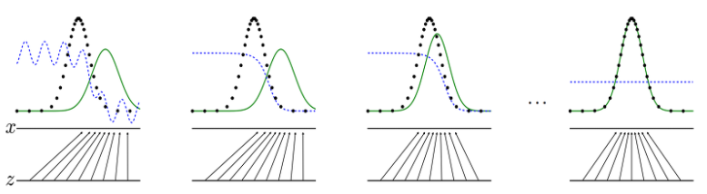

## GAN (Generative Adversarial Network)

> https://yamalab.tistory.com/98

- GAN을 이름 그대로 해석하자면, '적대적 생성 모델'

- 일반적인 머신 러닝 모델이 생성해내는 것은 class에 대한 예측값, 혹은 continuous random variable에 대한 interval prediction 등의 결과, 그 결과는 어떤 형태가 아닌 가장 높은 probability 혹은 likelihood

- GAN은 여기서 한발 더 나아가, '데이터의 형태' 를 만들어냄, 데이터의 형태라는 것은 분포 혹은 분산을 의미

  

      
      
Goodfellow, Ian J., et al. "Generative adversarial networks." arXiv preprint arXiv:1406.2661 (2014).

  

- 분포를 만들어낸다는 것은, 단순히 결과값을 도출해내는 함수를 만드는 것을 넘어서 '실제적인 형태' 를 갖춘 데이터를 만들어낸다는 것

- 요약하자면 GAN은 어떤 분포 혹은 분산 자체를 만들어내는 모델

  

      
      
Model configuration and learning flow in GAN

  

- ***Adversarial*** : 각각의 서로 다른 역할을 가진 두 개의 모델을 통해 진짜같은 가짜를 생성해내는 능력을 키워주는 것이 GAN의 핵심 아이디어

